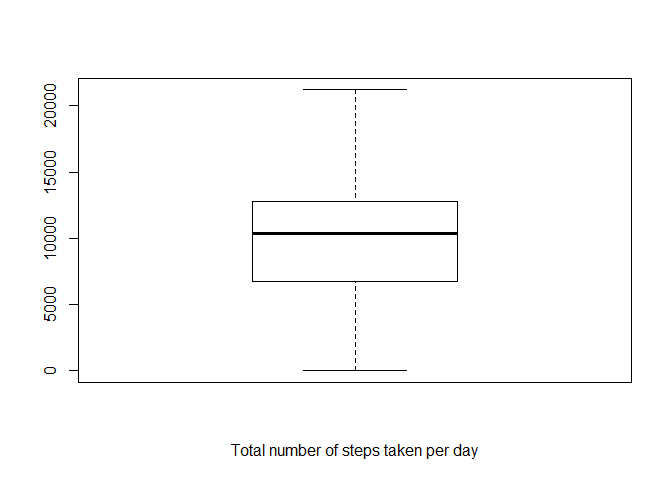

## Loading and preprocessing the data

```r
# Loading libraries
library(dplyr)
```

```
## Warning: package 'dplyr' was built under R version 3.4.2
```

```
## 
## Attaching package: 'dplyr'
```

```
## The following objects are masked from 'package:stats':
## 
##     filter, lag
```

```
## The following objects are masked from 'package:base':
## 
##     intersect, setdiff, setequal, union
```

```r
library(ggplot2)
library(lubridate)
```

```
## Warning: package 'lubridate' was built under R version 3.4.4
```

```
## 
## Attaching package: 'lubridate'
```

```
## The following object is masked from 'package:base':
## 
##     date
```
#### Downloading the data if the zip file does not exist, extracting and reading the csv file.

```r
setwd("~\\GitHub\\RepData_PeerAssessment1")
if(!exists("data.zip")){
download.file("https://d396qusza40orc.cloudfront.net/repdata%2Fdata%2Factivity.zip","data.zip")
unzip("data.zip")
}
activity<-read.csv("activity.csv",header = T) %>% as_tibble()
# Converting date to correct format
activity$date <-ymd(activity$date)
# Filtering out NAs
activity<-activity %>% filter(!is.na(steps))
```

```
## Warning: package 'bindrcpp' was built under R version 3.4.4
```
## What is mean total number of steps taken per day?

```r
daily_activity<-activity %>% group_by(date) %>% summarise(mean_steps=mean(steps))
boxplot(daily_activity$mean_steps,xlab = "Total number of steps taken per day")
```

<!-- -->

```r
hist(daily_activity$mean_steps,xlab = "Total number of steps taken per day")
```

<!-- -->

```r
"Mean of daily total steps is " %>% paste( mean(activity$steps,na.rm = T))
```

```
## [1] "Mean of daily total steps is  37.3825995807128"
```
## What is the average daily activity pattern?

```r
plot(daily_activity,type="l")
```

<!-- -->
## Imputing missing values


```r
# This has been done in a earlier step
#activity<-activity %>% filter(!is.na(steps))
```

## Are there differences in activity patterns between weekdays and weekends?

```r
plot(weekdays(daily_activity$date) %>% as.factor(),daily_activity$mean_steps)
abline(h=mean(daily_activity$mean_steps),col="red")
```

<!-- -->
