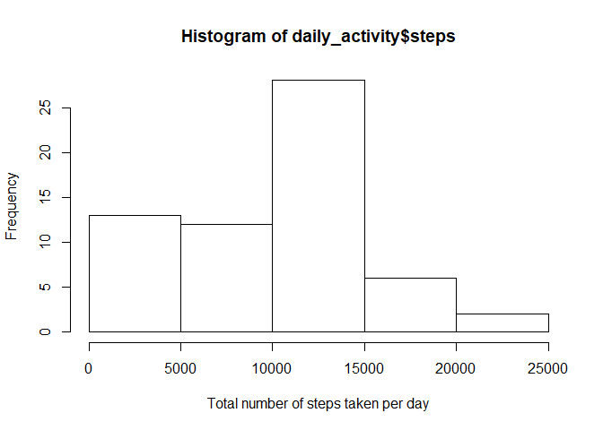

## Loading and preprocessing the data

```r
# Loading libraries
library(dplyr)
library(ggplot2)
library(lubridate)
library(kableExtra)
```

## Downloading the data if the zip file does not exist, extracting and reading the csv file.


```r
setwd("~\\GitHub\\RepData_PeerAssessment1")
if(!exists("data.zip")){
download.file("https://d396qusza40orc.cloudfront.net/repdata%2Fdata%2Factivity.zip","data.zip")
unzip("data.zip")
}
activity<-read.csv("activity.csv",header = T) %>% as_tibble()
# Converting date to correct format
activity$date <-ymd(activity$date)
```
## Imputing the missing values

```r
nrow(activity)/nrow(activity %>% filter(is.na(activity$steps)))
```

```
## [1] 7.625
```

```r
### There are about 7% missing values. We will fill those with median values
activity$steps[which(is.na(activity$steps))]<-median(activity$steps,na.rm = T)
```

## Total number of steps per day is calculated


```r
daily_activity<-activity %>% group_by(date) %>% summarise(steps=sum(steps))
head(daily_activity)
```

```
## # A tibble: 6 x 2
##   date       steps
##   <date>     <dbl>
## 1 2012-10-01     0
## 2 2012-10-02   126
## 3 2012-10-03 11352
## 4 2012-10-04 12116
## 5 2012-10-05 13294
## 6 2012-10-06 15420
```

```r
boxplot(daily_activity$steps,xlab = "Total number of steps taken per day")
```

<!-- -->

## Histogram of the total number of steps taken each day


```r
hist(daily_activity$steps,xlab = "Total number of steps taken per day")
```

<!-- -->

## Mean and median number of steps taken each day


```r
"Mean of daily total steps is " %>% paste( mean(daily_activity$steps,na.rm = T))
```

```
## [1] "Mean of daily total steps is  9354.22950819672"
```

```r
"Median of daily total steps is " %>% paste( median(daily_activity$steps,na.rm = T))
```

```
## [1] "Median of daily total steps is  10395"
```

## Time series plot of the average number of steps taken


```r
plot(x=daily_activity$date,y=daily_activity$steps,type="l")
```

<!-- -->

## The 5-minute interval that contains the maximum number of steps


```r
activity %>% group_by(interval) %>% summarise(steps=mean(steps)) %>% top_n(1,wt=steps)
```

```
## # A tibble: 1 x 2
##   interval steps
##      <int> <dbl>
## 1      835  179.
```

## Are there differences in activity patterns between weekdays and weekends?


```r
# Marking weekdays and weekends
daily_activity<-daily_activity %>% mutate(wd=ifelse(weekdays(date)=="Sunday"|weekdays(date)=="Saturday","Weekends","Weekdays"))


plot(daily_activity$wd %>% as.factor(),daily_activity$steps)
abline(h=mean(daily_activity$steps),col="red")
```

<!-- -->

## Panel plot comparing the average number of steps taken per 5-minute interval across weekdays and weekends


```r
temp<-activity %>% mutate(wd=ifelse(weekdays(date)=="Sunday"|weekdays(date)=="Saturday","Weekends","Weekdays")) %>% group_by(interval,wd,date) %>% summarise(steps=mean(steps))

temp.wd<-temp %>% filter(wd=="Weekdays")
temp.we<-temp %>% filter(wd=="Weekends")

par(mfrow=c(2,2))
plot(x=temp.wd$date,y=temp.wd$steps,type="p")
plot(x=temp.we$date,y=temp.we$steps,type="p")
```

<!-- -->
